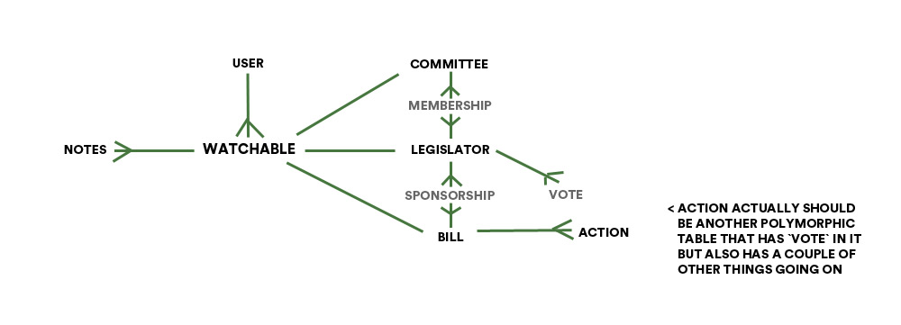

## 10/4

### links

- [api docs](https://www.propublica.org/datastore/api/propublica-congress-api)
- [api update schedule](https://projects.propublica.org/api-docs/congress-api/#data-update-schedules)
- [api members endpoint](https://projects.propublica.org/api-docs/congress-api/members/)
- [activejobs docs](http://guides.rubyonrails.org/active_job_basics.html)
- [stackoverflow undefined method for class](https://stackoverflow.com/questions/35965231/ruby-undefined-method-for-class-method)

### terminal

- running `getlegs.rb` a bunch

### thought process

- thinking about how to create a polymorphic structure for `watchables` table
- thinking about how to write the seed file so it grabs all the data initially
- look into activejob to automate the refreshing of the database
- is there an api endpoint i could ping to see how recently the data in it was updated?
- the actions / hearings / votes relationships between bills, committees, and legislators. yikes

### visuals

### other

i have a couple of migrations that havent been checked in / run yet. need to keep them checked out until i figure out some of the above.

### next steps

- do some solid thinking / wireframing on next steps for app functionality and structure
- figure out exactly what the database relationships should be
- do some research into the legislative process
- figure out how to seed the database
- update the migrations

